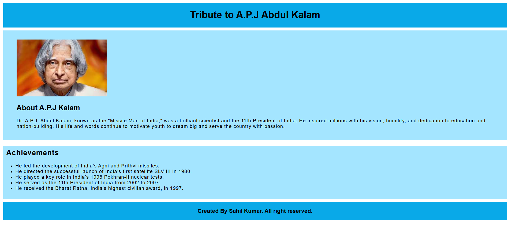

# 🚀 Tribute Page: Dr. A.P.J. Abdul Kalam

A heartfelt tribute to the *Missile Man of India*, created using **HTML** and **CSS**.  
This project honors the life, achievements, and vision of **Dr. A.P.J. Abdul Kalam**, one of India’s greatest scientists and leaders.

### 🌐 Live Website
[Click to View Project](https://hunnybunny14.github.io/apj-tribute-page)

---

### 💡 Technologies Used
- HTML5
- CSS3

---

### 📸 Preview  

---

### 📁 Folder Structure
├── index.html
├── style.css
└── preview.png

---

### 🙌 Inspiration
This tribute page is a simple way of remembering Dr. Kalam’s immense contribution to India and the youth of this country.

---

### 📬 Connect with Me
- 🔗 GitHub: [@hunnyBunny14](https://github.com/hunnyBunny14)
- 📷 Instagram: [@hunny.aibot](https://instagram.com/hunny.aibot)
